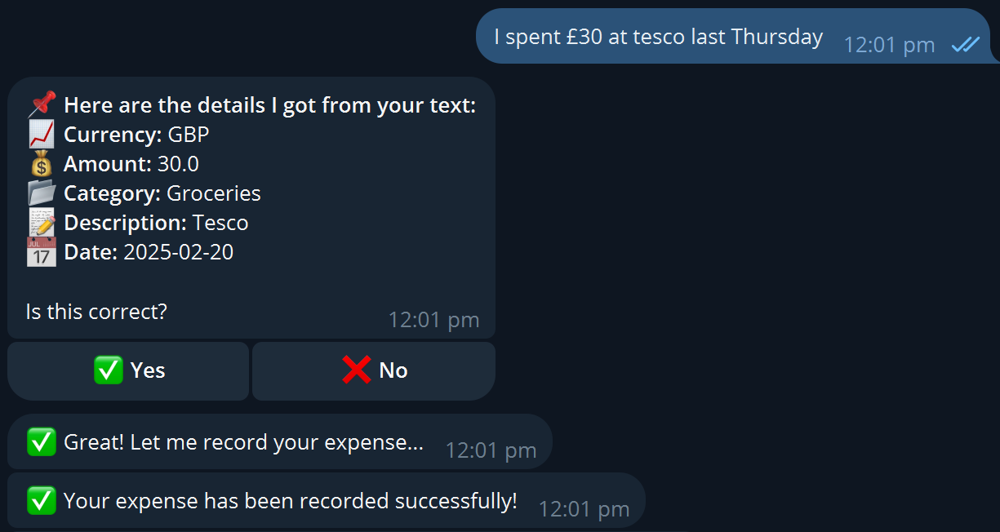
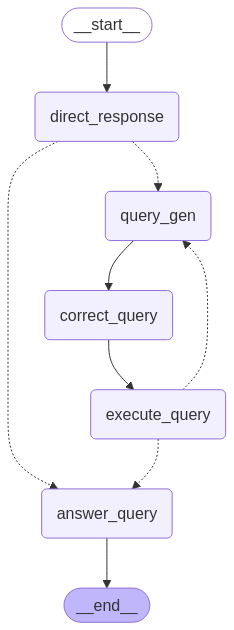
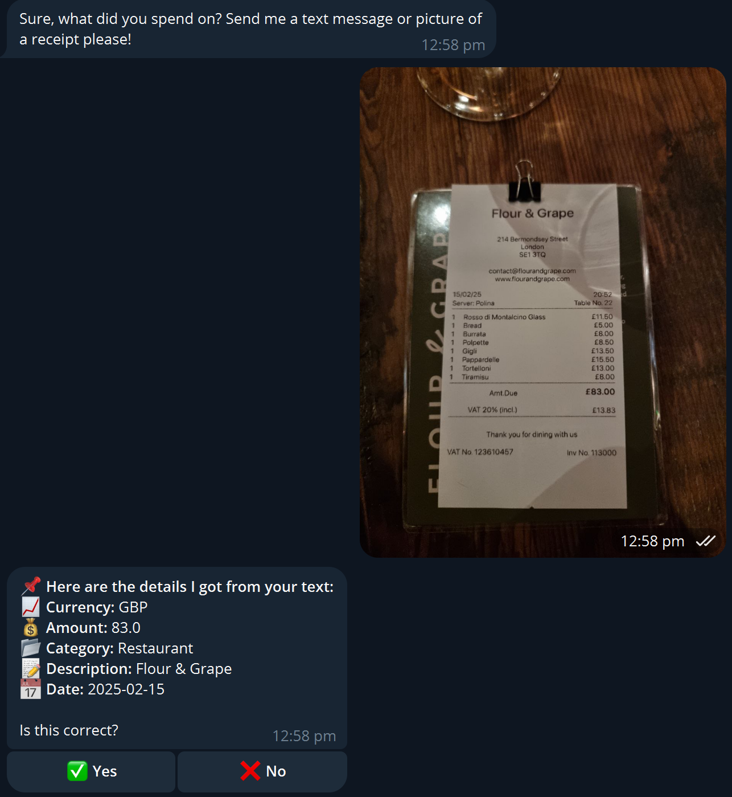
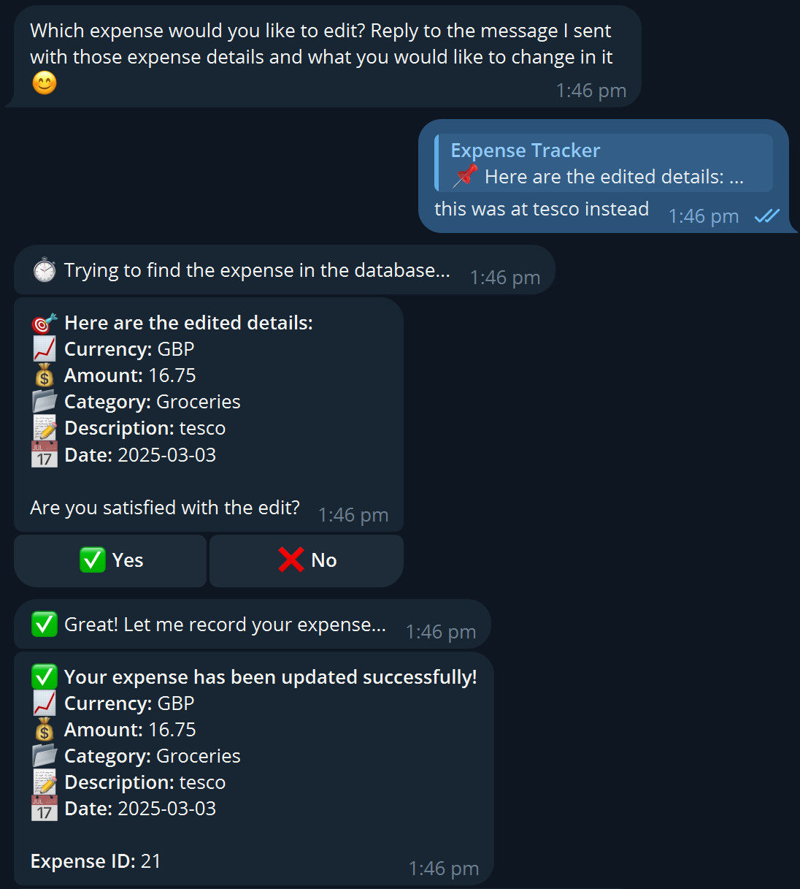

<a id="readme-top"></a>


<!-- PROJECT HEADER -->
<br />
<div align="center">
<h1 align="center">Expense Tracking Telegram Bot</h1>

  <p align="center">
    A Telegram bot for LLM-powered expense tracking.
    <br />
    <a href="https://github.com/crong12/expense-tracker-tele-bot/issues/new?labels=bug&template=bug-report---.md">Report Bug</a>
    &middot;
    <a href="https://github.com/crong12/expense-tracker-tele-bot/issues/new?labels=enhancement&template=feature-request---.md">Request Feature</a>
  </p>
</div>


<!-- TABLE OF CONTENTS -->
<details>
  <summary>Table of Contents</summary>
  <ol>
    <li>
      <a href="#about-the-project">About The Project</a>
      <ul>
        <li><a href="#expense-tracking">Expense Tracking</a></li>
        <li><a href="#why-a-telegram-bot">Why a Telegram Bot?</a></li>
        <li><a href="#how-is-this-different-from-a-regular-app">How is this different from a regular app?</a></li>
        <li><a href="#agentic-workflow">Agentic Workflow</a></li>
        <li><a href="#built-with">Built With</a></li>
      </ul>
    </li>
    <li>
      <a href="#project-directory">Project Directory</a>
    </li>
    <li>
      <a href="#getting-started">Getting Started</a>
      <ul>
        <li><a href="#prerequisites">Prerequisites</a></li>
        <li><a href="#installation">Installation</a></li>
      </ul>
    </li>
    <li><a href="#usage">Usage</a></li>
    <li><a href="#personal-thoughts">Personal Thoughts</a></li>
    <li><a href="#contributing">Contributing</a></li>
    <li><a href="#license">License</a></li>
    <li><a href="#acknowledgments">Acknowledgments</a></li>
  </ol>
</details>


<!-- ABOUT THE PROJECT -->
## About The Project

### Expense Tracking

Expense tracking is something that we all know we should be doing, but unfortunately not enough of us are. The benefits of tracking one's daily expenses are evident &ndash; for financial planning and literacy, as well as the cultivation of responsible spending habits. 

While I have been recording my expenses on a daily basis for the past 6 years, I must admit that it required a lot of discipline and it was definitely not easy to keep at it consistently, especially at the start. Tracking one's expenses sounds easy, but can actually be a **time-consuming** process that may require a fair bit of cognitive load to calculate and enter each expense correctly.

Therefore, I created this Telegram bot as a personal project to further automate the process of expense tracking, and to hopefully alleviate some of the pain of doing so. 

### Why a Telegram Bot?

The obvious idea would be a standalone app, but for reasons mentioned above, plus the fact that there are already many professionally created apps out there, I doubt I'd be able to value-add much in that space.

Telegram is a versatile messaging app that virtually everyone I know uses (I know WhatsApp still prevails in many other countries &ndash; hopefully this convinces some to switch to Telegram!). Thus, instead of yet another nameless app, why not leverage a platform that is already ubiquitous? Since we already have a deeply-ingrained habit of using Telegram on a daily &ndash; sometimes hourly &ndash; basis, I want to use this to leapfrog some of the inertia. 

On a side note, it also alleviates the burden of frontend development and allows me to focus wholly on functionality, so that's a big W :D

### How is this different from a regular app?

Regular expense tracking apps require one to insert expense details into specified fields (e.g. amount spent, category, etc.) with limited variability. Just not very smart in general.

Thus, I designed this bot to act as a smart "assistant" &ndash; the user just needs to enter their expense in plain text, and the relevant details will be parsed automatically. This is possible due to the semantic understanding capabilities of LLMs (I use `gemini-1.5-flash` and `gpt-4o-mini` for this project). By leveraging LLMs, the bot's functionalities have much room for growth. 

<br/>

<div align="center">
  <br>
  <sub>Screenshot of an expense recording instance. The model is able to parse the category correctly, although it is possible to make changes if need be (for example, if you want <code>Supermarket</code> as a category instead of <code>Groceries</code>).</sub>
</div>

### Agentic Workflow

The key feature of my bot is the ability for a user to leverage an AI agent for dynamic querying of their expenses, enabling smarter insights and even useful advice to improve one's spending habits.

To do so, I utilised LangGraph to create an agentic workflow for this analytics task. My LLM of choice for this agent is `gpt-4o-mini` due to general performance, latency, and costs relative to other options out there. While the `gemini` suite of models is great, the low rate limit of 5 RPM was simply insufficient for agentic workflows, where multiple LLM calls have to be made in quick succession.

<br/>

<div align="center">
  <br>
  <sub><b>Figure 2:</b> Visualisation of the agentic workflow.</sub>
</div>

<br/>

Upon receiving a query from the user, the agent first decides if the question warrants querying of the `expenses` database to get an answer. If the question can be answered by a direct response, the process is routed straight to the `answer_query` node. 

```python
Example: {'user_query': 'Please give me some general tips on managing spending habits.'}
```

<br/>

Conversely, if the query requires more in-depth analysis of the user's expenses, the process will be routed to the `query_gen` state, where the agent will generate a SQL query to extract the relevant data. This generated query gets passed into the `correct_query` state, where an LLM is invoked to detect any potential errors (e.g. syntax), and make changes if necessary. In the `execute_query` state, a database query tool is called. If an error occurs, the error is surfaced to the agent and the `query_gen` cycle repeats. Otherwise, the output from the query is passed to the `answer_query` state for formulation of the final answer.

```python
Example: {'user_query': 'Please summarize my expenditure for this month.'}
```

<br/>

In the (near?) future, I want to extend this agentic workflow to the entire process. Doing so will require a much more complex workflow graph with more complicated state management, and possibly a multi-agent system. However, the possibilities are endless and it's something I'm really excited about. Stay tuned! 🚨

### Built With

- [![Docker][docker-shield]][docker-url]
- [![FastAPI][fast-api-shield]][fast-api-url]
- [![Google Cloud][gcp-shield]][gcp-url]
- [![LangGraph][Langgraph-shield]][Langgraph-url]
- [![OpenAI][openai-shield]][openai-url]
- [![PostgreSQL][Postgresql-shield]][Postgresql-url]
- [![Python][Python-shield]][Python-url]
- [![Telegram bot API][tele-bot-shield]][tele-bot-url]


<p align="right">(<a href="#readme-top">back to top</a>)</p>


<!-- PROJECT DIRECTORY -->
## Project Directory

```
expense-tracker-tele-bot/
│── main.py                  # Main script
│── config.py                # Config settings
│── database.py              # Database connection and ORM classes
│── utils.py                 # Miscellaneous util functions
│── handlers/                # Folder containing bot handler functions
│   ├── __init__.py       
│   ├── misc_handlers.py            
│   ├── expenses_handler.py         
│   └── export.py         
│── services/                # Folder containing other key functions
│   ├── __init__.py          # (e.g. for LLM integration)
│   ├── gemini_svc.py     
│   └── expenses_svc.py  
│── feature_announcement.py  # Standalone script for broadcasting new features
│── requirements.txt         # Dependencies
│── Dockerfile               # For deployment
│── .dockerignore            
│── .gitignore
│── images/                  # Folder containing demo screenshots
│── LICENSE                  # MIT license file
│── CHANGELOG.md             # Documentation of changes made to bot
└── README.md                # Project description
```

<p align="right">(<a href="#readme-top">back to top</a>)</p>


<!-- GETTING STARTED -->
## Getting Started

To try this bot for yourself, follow these steps.

### Prerequisites

- Python 3.8+ (this was built with 3.11)
- Google Cloud SQL instance (PostgreSQL)
  - For setting up a PostgreSQL database using Google Cloud SQL, I referred mainly to [this tutorial](https://cloud.google.com/sql/docs/postgres/connect-instance-cloud-shell).
- Google Cloud Project with Vertex AI and billing enabled 
  - To get started with Google Cloud Projects and Vertex AI, [this](https://cloud.google.com/vertex-ai/docs/start/cloud-environment) is a good starting point.
- Google Cloud Secret Manager for storage of secret variables (API keys and such)
  - Quickstart [here](https://cloud.google.com/secret-manager/docs/create-secret-quickstart).
- Telegram Bot API Token
  - [This](https://core.telegram.org/bots/tutorial) is a comprehensive introduction to using Telegram bots.
- Docker 
- Google Cloud SDK

### Installation

<br/>

**1. Clone this repo**
   ```sh
   git clone https://github.com/crong12/expense-tracker-tele-bot.git
   ```

<br/>

**2. Set up Google Cloud Secrets**
   ```sh
   # Create secrets
   gcloud secrets create TELE_BOT_TOKEN --replication-policy="automatic"
   gcloud secrets create REGION --replication-policy="automatic"
   gcloud secrets create INSTANCE_NAME --replication-policy="automatic"
   gcloud secrets create DB_USER --replication-policy="automatic"
   gcloud secrets create DB_PASSWORD --replication-policy="automatic"
   gcloud secrets create DB_NAME --replication-policy="automatic"

   # Then add values
   gcloud secrets versions add TELE_BOT_TOKEN --data-file=<(echo "your-telegram-bot-token")
   gcloud secrets versions add REGION --data-file=<(echo "your-region")
   gcloud secrets versions add INSTANCE_NAME --data-file=<(echo "your-cloud-sql-instance-name")
   gcloud secrets versions add DB_USER --data-file=<(echo "your-db-user")
   gcloud secrets versions add DB_PASSWORD --data-file=<(echo "your-db-password")
   gcloud secrets versions add DB_NAME --data-file=<(echo "your-db-name")
   ```

  Or you could do it within the browser console as well if that's easier.

<br/>

**3. Enable necessary Google Cloud APIs**
   ```sh
   gcloud services enable run.googleapis.com \
    cloudbuild.googleapis.com \
    sqladmin.googleapis.com \
    secretmanager.googleapis.com \
    aiplatform.googleapis.com
   ```

<br/>

**4. Build and deploy bot to Google Cloud Run**  
<br/>
   4.1 Authenticate Docker with Google Cloud
   ```sh
   gcloud auth configure-docker your-region-docker.pkg.dev
   ```
   4.2 Build Docker image
   ```sh
   docker build -t your-region-docker.pkg.dev/your-project-id/your-repo/image-name .
   ```
   4.3 Push to Google Artifact Registry
   ```sh
   docker push your-region-docker.pkg.dev/your-project-id/your-repo/image-name
   ```
   4.4 Deploy to Google Cloud Run
   ```sh
   gcloud run deploy service-name \
    --image=your-region-docker.pkg.dev/your-project-id/your-repo/image-name \
    --region your-region \
    --platform=managed \
    --allow-unauthenticated \
    --set-env-vars PORT=8080
   ```

<br/>

**5. Set up webhook**
   ```sh
   curl -X POST "https://api.telegram.org/bot<your-bot-token>/setWebhook?url=<your-cloud-run-url>"
   ```

<br/>

**6. Change git remote url to avoid accidental pushes to base project**
   ```sh
   git remote set-url origin github_username/repo_name
   git remote -v 
   ```

<p align="right">(<a href="#readme-top">back to top</a>)</p>


<!-- USAGE -->
## Usage

### **1️⃣ Start the Bot**

Send **`/start`** to initialize the bot and open the main menu.

### **2️⃣ Add an Expense**

Click **`📌 Insert Expense`**, then either type an expense in plain text (e.g., "Spent $10 on coffee at Starbucks yesterday"), or send an image (e.g., a picture of a receipt).

The bot will extract the following details:
- Currency
- Amount
- Category
- Description
- Date

<p align="center">
  
</p>

*Screenshot of an expense recording instance with image input. Using `Gemini-1.5-Flash`'s multimodal capabilities, expenses can easily be parsed from images such as receipts, further easing the expense adding process.*

### **3️⃣ Edit Expense Details**
Click **`🔧 Edit Expense`** and reply to a message from the bot with the relevant expense details, stating the edits to be made. 

<p align="center">
  
</p>

*Screenshot of an expense editing instance. The bot is able to find the exact expense in the database using the `expense_id` associated with every saved expense.*

### **4️⃣ Delete Expenses**
Click **`🗑️ Delete Expenses`** and either reply to a message from the bot with the relevant expense details, or tell the bot to delete all expenses.

### **5️⃣ Analyse Expenses**
Click **`🔍 Analyse Expenses`** and ask the bot something about your expenses.

<p align="center">
  
</p>

### **6️⃣ Export Expenses**
Click **`📊 Export Expenses`** to receive a CSV file of your past expenses.

### **7️⃣ Quit the Bot**
Click **`❌ Quit`** or type **`/quit`** at any point in the conversation to exit.

<p align="right">(<a href="#readme-top">back to top</a>)</p>


## Personal Thoughts

This is a project of many firsts. It's my first time doing dev stuff, working with LLMs, agents, deployment, the cloud, and even async programming. Despite the minimal front-end workload in terms of UI development, having to learn the Telegram Bot API framework from scratch more than made up for it, in my opinion. 

It has been a great experience stepping out of my comfort zone, and I relished the challenge of learning so many new tools and frameworks to get this thing to work. As this is a project that I have personal stake in (as I will actually be using this to track my daily expenses), I'm extremely motivated to give it my best shot, and to make a product worth using. 

I know it's not perfect &ndash; there are definitely loads of things I can improve. However, I do think it's exciting having an imperfect product with room to grow. I'll definitely keep thinking of ways to improve this bot, and by doing so, improve myself as well. 💪

<p align="right">(<a href="#readme-top">back to top</a>)</p>


<!-- CONTRIBUTING -->
## Contributing

As this is my first foray into working with LLMs and dev work, any contributions are greatly appreciated.

If you have a suggestion to improve the bot, be it functionality or even best practice advice, please fork the repo and create a pull request. You can also simply open an issue with the tag "enhancement".

1. Fork the repo
2. Create your Feature Branch (`git checkout -b feature/AmazingFeature`)
3. Commit your Changes (`git commit -m 'Add some AmazingFeature'`)
4. Push to the Branch (`git push origin feature/AmazingFeature`)
5. Open a Pull Request

<br/>

**Caveat:** I am extremely busy with my full-time MSc course and upcoming internship, so unfortunately new features in the pipeline may not come anytime soon. I do love working on this project (as I'm using it on a daily basis), and will definitely work on implementing new features whenever I can.

Also, while my bot is currently up and running, testing will only be open to a bunch of close friends as I only have that many Google Cloud/ OpenAI credits 😔 However, I implore you to set the bot up for yourself (first-time Google Cloud users get a bunch of free credits anyway) and give it a try! 🚀

<p align="right">(<a href="#readme-top">back to top</a>)</p>


<!-- LICENSE -->
## License

Distributed under the [MIT license](LICENSE).

<p align="right">(<a href="#readme-top">back to top</a>)</p>


<!-- ACKNOWLEDGMENTS -->
## Acknowledgments

* My friends and loved ones for testing my bot and providing invaluable feedback.

* Huge thanks to [this repo](https://github.com/othneildrew/Best-README-Template) for the amazing README template.

* The 🤗 HuggingFace agents course for being a great resource to get started with agents! If anyone's reading this, I highly recommend the course.

* Google and ChatGPT for being the best teachers out there, without whom this project would've taken much, *much* longer to do up.

<p align="right">(<a href="#readme-top">back to top</a>)</p>


<!-- MARKDOWN LINKS & IMAGES -->
<!-- https://www.markdownguide.org/basic-syntax/#reference-style-links -->
[Python-shield]: https://img.shields.io/badge/python-3670A0?style=for-the-badge&logo=python&logoColor=ffdd54
[Python-url]: https://www.python.org/
[Langgraph-shield]: https://img.shields.io/badge/LangGraph-1C3C3C?style=for-the-badge&logo=langgraph&logoColor=white
[Langgraph-url]: https://www.langchain.com/langgraph
[openai-shield]: https://img.shields.io/badge/OpenAI-000000?style=for-the-badge&logo=openai&logoColor=white
[openai-url]: https://platform.openai.com/docs/overview
[Postgresql-shield]: https://img.shields.io/badge/postgresql-4169e1?style=for-the-badge&logo=postgresql&logoColor=white
[Postgresql-url]: https://www.postgresql.org/
[tele-bot-shield]: https://img.shields.io/badge/telegram%20bot%20api-2CA5E0?style=for-the-badge&logo=telegram&logoColor=white
[tele-bot-url]: https://core.telegram.org/bots/api
[gcp-shield]: https://img.shields.io/badge/Google%20Cloud-FFFFFF?style=for-the-badge&logo=data:image/svg+xml;base64,PD94bWwgdmVyc2lvbj0iMS4wIiBlbmNvZGluZz0iVVRGLTgiPz4KPCEtLSBVcGxvYWRlZCB0bzogU1ZHIFJlcG8sIHd3dy5zdmdyZXBvLmNvbSwgR2VuZXJhdG9yOiBTVkcgUmVwbyBNaXhlciBUb29scyAtLT4KPHN2ZyB3aWR0aD0iODAwcHgiIGhlaWdodD0iODAwcHgiIHZpZXdCb3g9IjAgLTI1IDI1NiAyNTYiIHZlcnNpb249IjEuMSIgeG1sbnM9Imh0dHA6Ly93d3cudzMub3JnLzIwMDAvc3ZnIiB4bWxuczp4bGluaz0iaHR0cDovL3d3dy53My5vcmcvMTk5OS94bGluayIgcHJlc2VydmVBc3BlY3RSYXRpbz0ieE1pZFlNaWQiPgoJCTxnPgoJCQkJPHBhdGggZD0iTTE3MC4yNTE3LDU2LjgxODYgTDE5Mi41MDQ3LDM0LjU2NTYgTDE5My45ODc3LDI1LjE5NTYgQzE1My40MzY3LC0xMS42Nzc0IDg4Ljk3NTcsLTcuNDk2NCA1Mi40MjA3LDMzLjkxOTYgQzQyLjI2NjcsNDUuNDIyNiAzNC43MzM3LDU5Ljc2MzYgMzAuNzE2Nyw3NC41NzI2IEwzOC42ODY3LDczLjQ0OTYgTDgzLjE5MTcsNjYuMTEwNiBMODYuNjI3Nyw2Mi41OTY2IEMxMDYuNDI0Nyw0MC44NTQ2IDEzOS44OTc3LDM3LjkyOTYgMTYyLjc1NTcsNTYuNDI4NiBMMTcwLjI1MTcsNTYuODE4NiBaIiBmaWxsPSIjRUE0MzM1Ij4KDTwvcGF0aD4KCQkJCTxwYXRoIGQ9Ik0yMjQuMjA0OCw3My45MTgyIEMyMTkuMDg5OCw1NS4wODIyIDIwOC41ODg4LDM4LjE0OTIgMTkzLjk4NzgsMjUuMTk2MiBMMTYyLjc1NTgsNTYuNDI4MiBDMTc1Ljk0MzgsNjcuMjA0MiAxODMuNDU2OCw4My40MzgyIDE4My4xMzQ4LDEwMC40NjUyIEwxODMuMTM0OCwxMDYuMDA5MiBDMTk4LjQ4NTgsMTA2LjAwOTIgMjEwLjkzMTgsMTE4LjQ1NDIgMjEwLjkzMTgsMTMzLjgwNTIgQzIxMC45MzE4LDE0OS4xNTcyIDE5OC40ODU4LDE2MS4yOTAyIDE4My4xMzQ4LDE2MS4yOTAyIEwxMjcuNDYzOCwxNjEuMjkwMiBMMTIxLjk5NzgsMTY3LjIyNDIgTDEyMS45OTc4LDIwMC41NjQyIEwxMjcuNDYzOCwyMDUuNzk1MiBMMTgzLjEzNDgsMjA1Ljc5NTIgQzIyMy4wNjQ4LDIwNi4xMDYyIDI1NS42ODY4LDE3NC4zMDEyIDI1NS45OTc4LDEzNC4zNzEyIEMyNTYuMTg1OCwxMTAuMTY4MiAyNDQuMjUyOCw4Ny40NzgyIDIyNC4yMDQ4LDczLjkxODIiIGZpbGw9IiM0Mjg1RjQiPgoNPC9wYXRoPgoJCQkJPHBhdGggZD0iTTcxLjg3MDQsMjA1Ljc5NTcgTDEyNy40NjM0LDIwNS43OTU3IEwxMjcuNDYzNCwxNjEuMjg5NyBMNzEuODcwNCwxNjEuMjg5NyBDNjcuOTA5NCwxNjEuMjg4NyA2NC4wNzM0LDE2MC40Mzc3IDYwLjQ3MTQsMTU4Ljc5MTcgTDUyLjU4NDQsMTYxLjIxMTcgTDMwLjE3NTQsMTgzLjQ2NDcgTDI4LjIyMzQsMTkxLjAzODcgQzQwLjc5MDQsMjAwLjUyNzcgNTYuMTIzNCwyMDUuODYzNyA3MS44NzA0LDIwNS43OTU3IiBmaWxsPSIjMzRBODUzIj4KDTwvcGF0aD4KCQkJCTxwYXRoIGQ9Ik03MS44NzA0LDYxLjQyNTUgQzMxLjkzOTQsNjEuNjYzNSAtMC4yMzY2LDk0LjIyNzUgMC4wMDE0LDEzNC4xNTc1IEMwLjEzNDQsMTU2LjQ1NTUgMTAuNTQ4NCwxNzcuNDQ1NSAyOC4yMjM0LDE5MS4wMzg1IEw2MC40NzE0LDE1OC43OTE1IEM0Ni40ODA0LDE1Mi40NzA1IDQwLjI2MzQsMTM2LjAwNTUgNDYuNTg0NCwxMjIuMDE1NSBDNTIuOTA0NCwxMDguMDI1NSA2OS4zNzA0LDEwMS44MDg1IDgzLjM1OTQsMTA4LjEyODUgQzg5LjUyNDQsMTEwLjkxMzUgOTQuNDYxNCwxMTUuODUxNSA5Ny4yNDY0LDEyMi4wMTU1IEwxMjkuNDk0NCw4OS43Njg1IEMxMTUuNzczNCw3MS44MzE1IDk0LjQ1MzQsNjEuMzQ0NSA3MS44NzA0LDYxLjQyNTUiIGZpbGw9IiNGQkJDMDUiPgoNPC9wYXRoPgoJCTwvZz4KPC9zdmc+
[gcp-url]: https://console.cloud.google.com/
[docker-shield]: https://img.shields.io/badge/docker-257bd6?style=for-the-badge&logo=docker&logoColor=white
[docker-url]: https://www.docker.com/
[fast-api-shield]: https://img.shields.io/badge/FastAPI-005571?style=for-the-badge&logo=fastapi
[fast-api-url]: https://fastapi.tiangolo.com/
